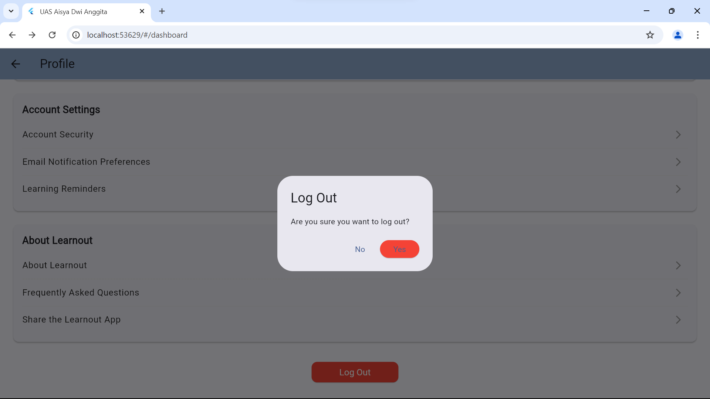

1. welcome_screen

Tampilan ini menampilkan Pengguna akan disambut dengan gambar dan teks, lalu diberikan pilihan untuk masuk (sign in) atau membuat akun baru (sign up). Desain ini umum digunakan dalam banyak aplikasi untuk menyambut pengguna baru.

2. signin screen

Program ini adalah implementasi antarmuka Sign In Screen menggunakan framework Flutter. Fittur utama menampilkan input Email dan Password. Terjadi eror apabila belum mempunyai akun, maka kita buat terlebih dahulu pada Sign Up 

3. Sign Up

Tampilan Sign Up ini kita disuruh untuk mengisi nama, emai, password, dan juga konfirmasi password. Supaya dapat masuk kedalam dashboard.

4. dashboard

Program ini adalah aplikasi Flutter dengan tampilan dashboard yang mencakup
AppBar dengan judul dan ikon untuk navigasi (pesan dan profil).
Body yang menampilkan gambar, teks deskripsi, kategori dalam bentuk chip, dan grid kursus.
BottomNavigationBar dengan tiga item navigasi: Home, Message, dan Profil.
Navigasi: Ikon pesan membuka halaman pesan, dan tombol lain belum memiliki fungsionalitas.

5. Message

Program ini menampilkan layar pesan dengan daftar pesan menggunakan ListView.builder. Setiap pesan ditampilkan dengan teks. Terdapat BottomNavigationBar untuk navigasi antara Home dan Messages.

6. Profile

Program ini menampilkan layar profil dengan avatar, beberapa pengaturan dalam card, dan opsi seperti "Video preference", "Account Settings" dan "About Lernout". Terdapat tombol "Log Out" di bagian bawah.

7. pop up log out

Program ini menampilkan layar profil dengan avatar, beberapa pengaturan dalam card, dan opsi seperti "Video preference", "Account Settings" dan "About Lernout". Terdapat tombol "Log Out" di bagian bawah.
